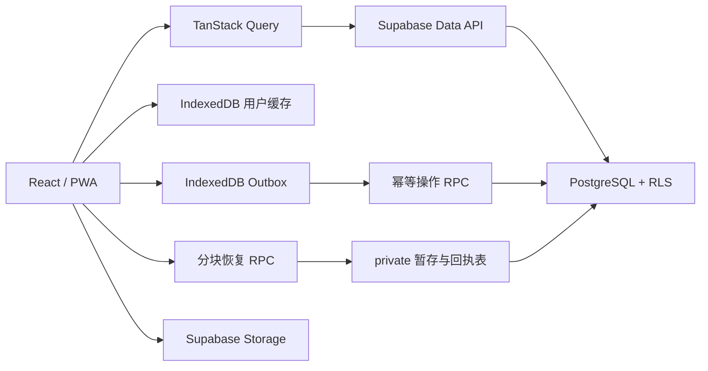

# 个人工作台

[](https://github.com/duyanta123/Personal-Workbench/actions/workflows/ci.yml)

一个面向个人长期使用的效率工作台，将待办、习惯、记账、目标、笔记、刷题、健身和番茄钟放在同一套数据模型中。应用支持本地自然语言快速记录、习惯强度洞察、结构化 CSV/待办日历导出，并采用邀请制账号、Supabase 云端同步和 PWA 离线缓存。

## 核心能力

| 模块 | 能力 |
| --- | --- |
| 工作台首页 | 今日待办、专注清单、习惯概览、月度开销、健身摘要和智能快速记录 |
| 每日计划 | 优先级、截止日期、置顶、拖拽排序、完成统计和稳定游标分页 |
| 习惯打卡 | 每日打卡、补卡、连续记录、近 7 天趋势和可解释强度评分 |
| 记账 | 收支记录、自定义分类、月度预算和分类统计 |
| 长期目标 | 目标进度、增量记录、置顶和完成状态 |
| 内容记录 | 笔记、标签、图片链接、置顶和多种内容布局 |
| 刷题记录 | 平台、难度、状态、标签、链接和完成日期 |
| 健身记录 | 训练、动作、组数、次数、重量、时长和身体指标 |
| 番茄钟 | 自定义专注/休息周期、待办关联、跨午夜和重启恢复 |
| 洞察复盘 | 跨模块统计、习惯强度分段、趋势和文本替代信息 |
| 全局搜索 | 跨模块检索并直接定位原始记录 |
| 数据互通 | Backup V3、10 类结构化 CSV 和一次性待办 ICS 日历 |

智能快速记录完全在浏览器本地解析，不接入第三方 AI 服务。首页输入一句话或按 `Ctrl/Cmd + K` 打开面板，确认预览后通过现有幂等 outbox 写入待办、记账或笔记。

## 可靠性与安全

- 非幂等操作使用持久化 IndexedDB outbox，携带稳定 `operationId`；服务端通过操作回执保证重复提交只生效一次。
- 每次数据恢复都会递增 `restore_epoch`，恢复前排队的旧设备操作无法重新写回。
- 备份恢复采用 `begin -> stage chunks -> finalize/abort` 协议，包含 revision 冲突检查、分块摘要和原子替换。
- TanStack Query 成功结果按用户持久化 7 天；离线重开仅允许最后登录用户读取缓存数据。
- Supabase RLS 隔离所有业务数据；`anon` 无业务表权限，敏感写入通过收紧后的 `security definer` RPC 完成。
- 账号采用邀请制，公开注册关闭，密码至少 12 位，并提供邀请接受、忘记密码和密码重置流程。
- PWA 使用提示式更新，避免 Service Worker 自动激活导致旧页面懒加载 chunk 失效。
- 生产部署模板包含 CSP、`nosniff`、Referrer Policy、Permissions Policy、SPA 回退和静态资源缓存策略。

## 运行架构



前端列表使用两种互不重叠的游标路径：普通业务表通过 PostgREST 复合谓词分页；刷题列表因多条件过滤和 `NULLS LAST` 排序，使用 `get_practice_page_cursor` RPC。测试会固定这一调用边界，避免双轨逻辑变成死代码。

## 技术栈

| 分类 | 技术 |
| --- | --- |
| 前端 | React 18、TypeScript、Vite 6 |
| 路由 | React Router 7 |
| 服务端状态 | TanStack Query |
| 客户端状态 | Zustand |
| 样式 | Tailwind CSS 4 |
| 后端 | Supabase Auth、PostgreSQL、Storage、RLS、RPC |
| PWA | vite-plugin-pwa / Workbox |
| 单元与组件测试 | Vitest、Testing Library |
| E2E | Playwright，固定使用系统 Chrome |
| 数据库测试 | Supabase CLI、pgTAP |
| 静态检查 | ESLint 9、typescript-eslint、React Hooks、jsx-a11y |

## 快速开始

### 环境要求

- Node.js 22+
- npm
- 本机 Google Chrome，用于 Playwright E2E
- Supabase CLI，仅在执行数据库操作时需要
- Docker 或 Podman，仅在本地重建和测试数据库时需要

项目不会通过 Playwright 下载 Chromium。本地和 CI 的 E2E 均使用系统 Chrome。

### 安装与配置

```bash
git clone https://github.com/duyanta123/Personal-Workbench.git
cd Personal-Workbench
npm ci
```

基于 `.env.example` 创建 `.env`：

```dotenv
VITE_SUPABASE_URL=https://your-project-ref.supabase.co
VITE_SUPABASE_ANON_KEY=your-anon-key
```

`VITE_` 变量会进入浏览器构建，只能放公开的 anon key。不要把数据库密码、service role key 或其他服务端密钥写入 `.env` 的 `VITE_` 变量。

启动开发服务器：

```bash
npm run dev
```

访问 [http://localhost:5173](http://localhost:5173)。账号需要由 Supabase Dashboard 或受信后台邀请，登录页不提供公开注册。

## 常用命令

| 命令 | 说明 |
| --- | --- |
| `npm run dev` | 启动 Vite 开发服务器 |
| `npm run build` | TypeScript 构建并生成生产产物 |
| `npm run preview` | 本地预览 `dist/` |
| `npm run lint` | 执行 ESLint，警告也会导致失败 |
| `npm run typecheck` | 执行 TypeScript 类型检查 |
| `npm test` | 运行 Vitest 单元与组件测试 |
| `npm run test:watch` | 以监听模式运行 Vitest |
| `npm run test:scripts` | 运行迁移解析等 Node 脚本测试 |
| `npm run test:e2e` | 使用系统 Chrome 运行 Playwright E2E |
| `npm run check:migrations` | 比较本地和已链接远程项目的迁移历史 |
| `npm run ci` | lint、类型检查、脚本测试、Vitest 和生产构建 |

## 数据库开发与发布

链接 Supabase 项目：

```bash
supabase login
supabase link --project-ref <project-ref>
```

发布数据库变更前必须依次执行：

```bash
# 1. 确认本地与远程迁移历史完全一致
npm run check:migrations

# 2. 审查即将应用的前向迁移
supabase db push --dry-run

# 3. 正式应用
supabase db push

# 4. 验证远程 schema
supabase db lint --linked --level warning
```

数据库规则：

1. 已应用到任何远程环境的迁移不得修改、重命名、压缩或删除。
2. 所有修复通过新的前向迁移完成。
3. `supabase/migrations/` 只包含可立即发布的核心迁移。
4. `supabase/deferred_migrations/` 不会被 `db push` 自动应用，必须按发布窗口移入核心迁移目录。
5. 私有头像切换和最终旧 RPC 撤权属于延迟迁移，发布条件及顺序见 [DEPLOYMENT.md](./DEPLOYMENT.md)。

本地数据库验证需要 Docker 或 Podman：

```bash
supabase db start
supabase db reset
supabase db lint --local --level warning
supabase test db
```

数据库测试覆盖匿名权限、双用户 RLS 隔离、私有 schema、头像目录、恢复权限、游标 RPC，以及重复 `operationId` 只写入一次。

## 备份与恢复

- 导出格式为 Backup V3；V1/V2 只作为兼容输入，由客户端归一化后走当前恢复协议。
- JSON 文件上限为 40 MiB；每块最多 500 行或 1 MiB。
- 单表最多 50,000 行，总计最多 200,000 行。
- 头像最多 5 张，单张解码后不超过 5 MiB。
- 恢复前必须处理本机未同步 outbox；丢弃未同步操作需要二次确认。
- `finalize_restore` 会重新检查 revision、分块完整性和引用映射，并在单个事务中替换数据。

## CI

[`.github/workflows/ci.yml`](./.github/workflows/ci.yml) 包含三个独立 job：

- `frontend`：安装依赖，运行 `npm run ci` 和依赖安全审计。
- `e2e`：确认 GitHub Runner 自带 Chrome，然后运行 Playwright；不安装 Chromium。
- `database`：从零执行核心迁移、lint 和 pgTAP，再加入延迟迁移与配套测试重复验证。

本地提交前建议至少运行：

```bash
npm run ci
npm run test:e2e
npm audit --audit-level=high
```

## 部署

构建产物位于 `dist/`：

```bash
npm run build
```

仓库已提供：

- `vercel.json`：Vercel SPA 回退、缓存与安全响应头。
- `public/_redirects`、`public/_headers`：Netlify 回退、缓存与安全响应头。
- [DEPLOYMENT.md](./DEPLOYMENT.md)：Vercel、Netlify、腾讯云 COS 和阿里云 OSS 的发布契约。

部署前还必须在 Supabase Auth 中完成：

- 关闭公开注册并保持邀请制。
- 将 Site URL 设置为当前环境的精确域名。
- 为 `/update-password` 配置精确回调白名单。
- 若使用 Supabase 自定义域名，同步更新 CSP 的 `connect-src` 和 `img-src`。

首次访问深链接必须由托管平台回退到 `index.html`，不能依赖用户已经安装 Service Worker。

## 项目结构

```text
.
|-- .github/workflows/       # 前端、E2E、数据库 CI
|-- e2e/                     # Playwright 场景
|-- public/                  # PWA 图标、SPA 回退与安全头模板
|-- scripts/                 # 迁移一致性检查及脚本测试
|-- src/
|   |-- components/          # 布局、认证、PWA 和通用 UI
|   |-- hooks/               # 查询、写入和业务流程 hooks
|   |-- lib/                 # Supabase、outbox、本地缓存、游标和类型
|   |-- pages/               # 按业务模块划分的页面
|   |-- stores/              # Zustand 状态
|   `-- utils/               # 校验、备份和统计等纯逻辑
|-- supabase/
|   |-- migrations/          # 核心前向迁移
|   |-- deferred_migrations/ # 需要观察窗口的延迟迁移
|   |-- deferred_tests/      # 延迟迁移配套 pgTAP
|   `-- tests/database/      # 核心数据库测试
|-- DEPLOYMENT.md            # 发布顺序和平台配置
|-- playwright.config.ts
|-- vercel.json
`-- vite.config.ts
```

## 发布检查清单

- `npm run ci`、系统 Chrome E2E 和依赖审计通过。
- 数据库快照或可验证的恢复点已经创建。
- `npm run check:migrations` 无差异，`db push --dry-run` 仅包含预期文件。
- 远程 `supabase db lint --linked --level warning` 无错误或警告。
- Supabase Auth Site URL、回调白名单和邀请制设置已核对。
- 深链接、PWA 更新、离线只读、退出清理和密码恢复已在目标环境验证。
- 延迟迁移只在 [DEPLOYMENT.md](./DEPLOYMENT.md) 的观察条件满足后发布。
